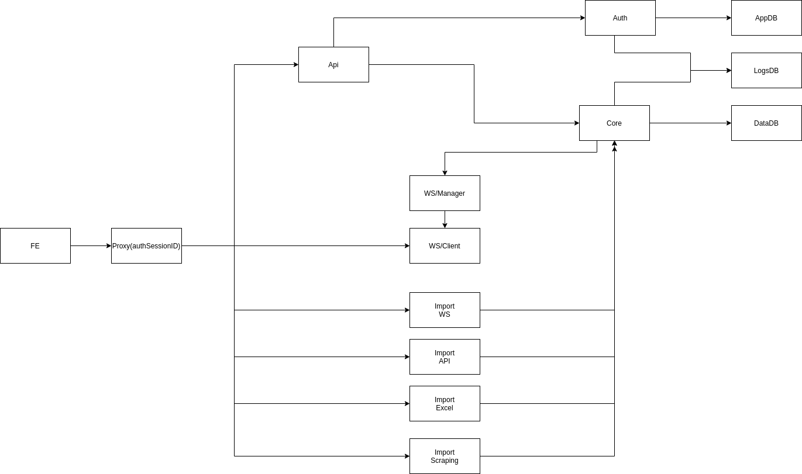

# Theoretical - Auction manager:

## About
- Vehicle auction aggregator
- Large scale backend
- Used by company clients (that want auction or sell) on 1 place


## Technologies and processes
For this assignment I would chose approach of dockerized microservices running on K8S with autoscaling.
 
### Name Lib && technology (If I had to develop)
- Frontend: Vue
- Proxy: Nginx
- Inner service communication: RabbitMQ
- Backend services: NodeJS
- AppDatabase: Postgres (users, sessions etc..), 
- DataDatabase: Postgres (for actual data)
- LogsDatabase: Mongo (for logs)


### Alternatives

- Frontend: Any single page framework (Angular, React, Vue) it depends on the developers experience with specific technology
(I would not chose serve site rendering page)
- Proxy: Apache
- Backend: Python, GO
- DataDatabase: Mongo, Cassandra (if postgres would not be enough)

## Architecture

Authentication (needed in biding process, not for reading):
For starting I would start just with session ID, so at each time we should check into DB is session is valid. 
If this would be an issues we will have to move on JWT which brings additional complications:
- auth service would still be issuer of those tokens
- in case of invalidating token we need to inform about that all services that do authentication
- we need to store invalid token for later if new service comes up need them (maybe redis) 

Bulk import
In case that bulk request would be to much, I would insert Kafka before the actual processing, which has much higher capabilities.




In above architecture the most of the work does `Core` service. In case that this would be an issues, we should split it into more microservices (for example auto action it own service, etc...).


### Flows
#### Auth
```text
EndUser->FE->Proxy->Api->Auth->AppDB
```

#### Registration
```text
EndUser->FE->Proxy->Api->Auth->AppDB
                             ->LogsDB
```

#### Import auctions
From the FE
(auth is done at each service itself)
```text
EndUser->FE->Proxy->Specific_import_service->Core->DataDatabase
                                                 ->WS/manager->WS/Client->EndUser
                                                 ->LogsDatabase
```
Services itself
```text
Specific_import_service->Core->DataDatabase
                             ->WS/manager->WS/Client->EndUser
                              ->LogsDatabase
```
#### Bidding auctions
Manual
```text
EndUser->FE->Proxy->Api->Core->DataDatabase
                             ->WS/manager->WS/Client->EndUser
                             ->LogsDatabase
```
Robot
```text
Core->DataDatabase
    ->WS/manager->WS/Client->EndUser
    ->LogsDatabase
```

#### Getting data
On page load
```text
EndUser->FE->Proxy->Api->Core->AppDatabase
                             ->DataDatabase
```

Updates
When user comes to page it opens the WS connection through which receives updates.
```text
Core->WS/manager->WS/Client->EndUser
```

#### Archive data
On page load
```text
Core->DataDatabase
```

#### Archive logs
On page load
```text
Core->LogsDatabase
```

## Plans
Must have is 1. point all other can be implemented in alter stages.
1. Retrieving info at least form 1 site, whole flow show on FE
2. Add additional imports
3. Real time notification feedbacks on updates
4. User management
5. Biding
6. Logs

## Timeline
1. Retrieving info at least form 1 site, whole flow show on FE: 0.5PM
2. Add additional imports: 1PM
3. Real time notification feedbacks on updates: 1PM 
4. User management: 0.25PM
5. Biding: 0.5PM
6. Logs: 0.5 PM
7. Maintaining
